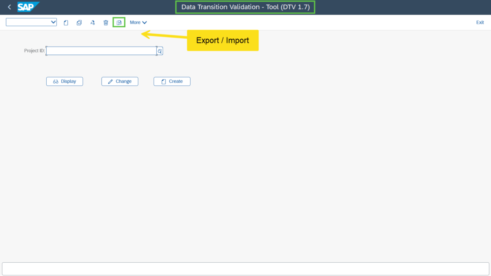

# Exercise 1: Login to ECC Source System

💡 At the end of this exercise, you will know how to land in the DTV tool.

## Step 1

Login to the ECC source system by using the information shared with you.

**Username:** `USERXX`  
**Password:** `Welcome1`  
**Client:** `100`

## Step 2

Execute transaction code `DTV`. You will land on the DTV tool.

> **Note:** In this screen you can check the different buttons and DTV features such as Export / Import functionality using which you can Import a DTV project.

## Next Exercise

Continue to **[Exercise 2: Create DTV Project](../ex2/README.md)**.
