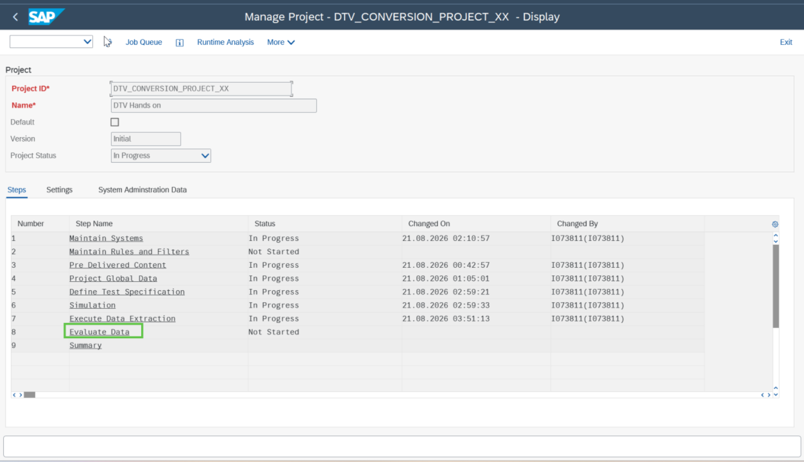
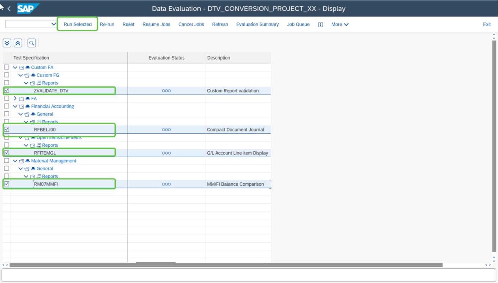

# Exercise 10: Run Evaluation

💡 At the end of this exercise, you should be able to run evaluation for all the reports and tables.

## Step 1

To evaluate the extracted data, double click on DTV step **“Evaluate Data”**.

## Step 2

Select all the reports and table for which you extracted the data and click on **“Run Selected”**.

## Next Exercise

Continue to **[Exercise 11: Validate Results](../ex11/README.md)**.
