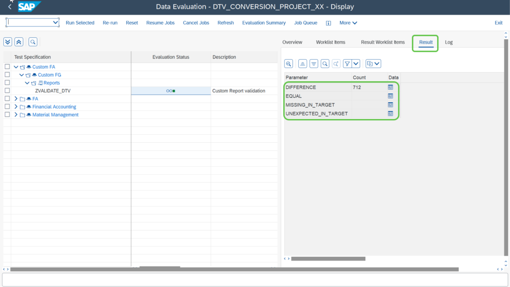

# Exercise 11: Validate Results

## Step 1

You can validate the results by double clicking on each report and check the result tab.

> **Note:** DTV evaluation is done by considering 4 parameters which are
> - DIFFERENCE
> - EQUAL
> - MISSING_IN_TARGET
> - UNEXPECTED_IN_TARGET

## Next Exercise

Continue to **[Exercise 12.1: Mitigating RM07MMFI issue](../ex12-1/README.md)**.
