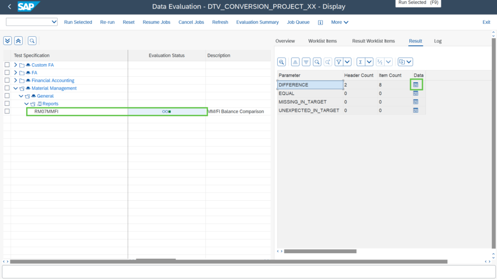
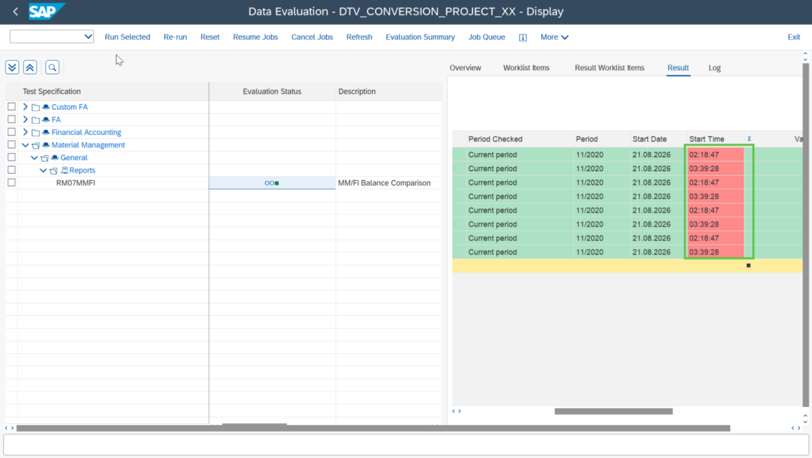
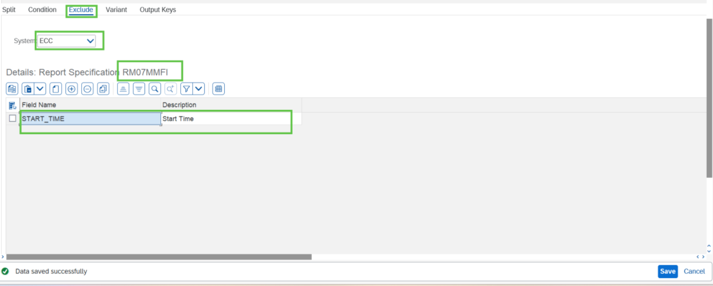
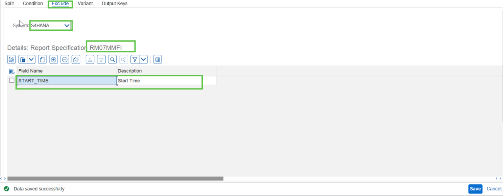
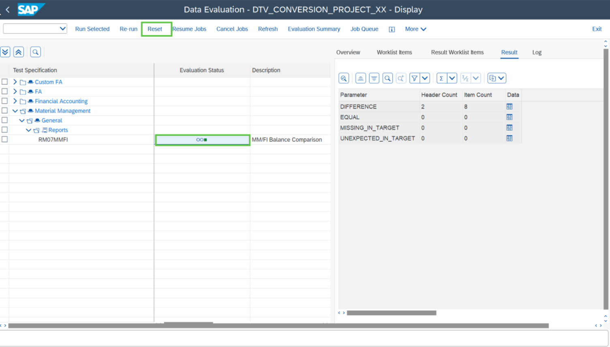
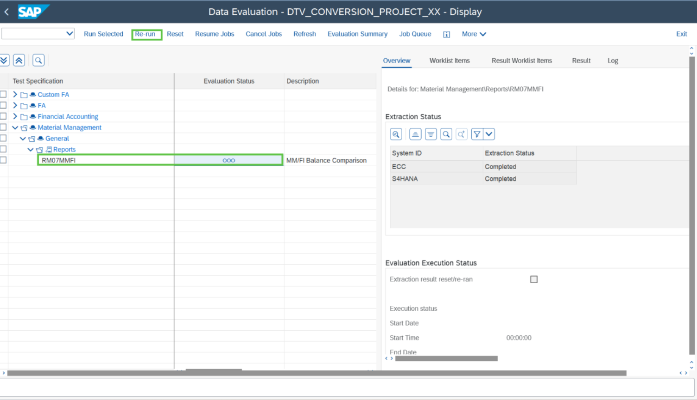
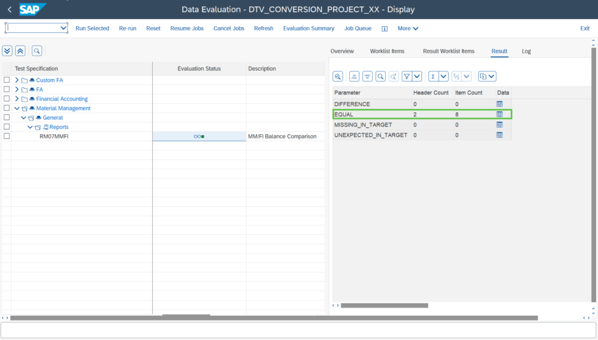

# Exercise 12.1: Mitigating RM07MMFI issue

## Step 1

You find discrepancies in the SAP report **RM07MMFI** as highlighted in the screenshot below.

You can check the details of the error by clicking on **Data icon**.

## Step 2

The error can be mitigated by simply excluding the parameter from comparison. You can exclude the parameter by adding it in the test specification screen for both source and target system respectively.

## Step 3

Reset the Evaluation of **RMM07MMFI** as highlighted in the screenshot below.

## Step 4

Run the Evaluation again as highlighted in the screenshot below.

## Next Exercise

Continue to **[Exercise 12.2: Mitigating the custom report issue](../ex12-2/README.md)**.
