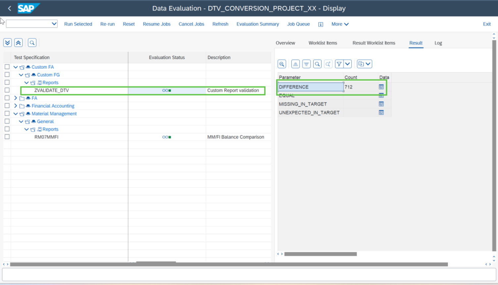

# Exercise 12.2: Mitigating the custom report issue

💡 At the end of this exercise, you should be able to validate the evaluation results and mitigate the issue.

## Step 1

You find discrepancies in the custom report **ZVALIDATE_DTV** as highlighted in the screenshot below.

You can check the details of the error by clicking on **Data icon**.

> **Note:** Here the user can notice that the price column for source and target system is not matching, and DTV is able to clearly show the differences. Users must take appropriate action to mitigate the issue.

## Feedback

[Continue to - Home Page](../README.md).
