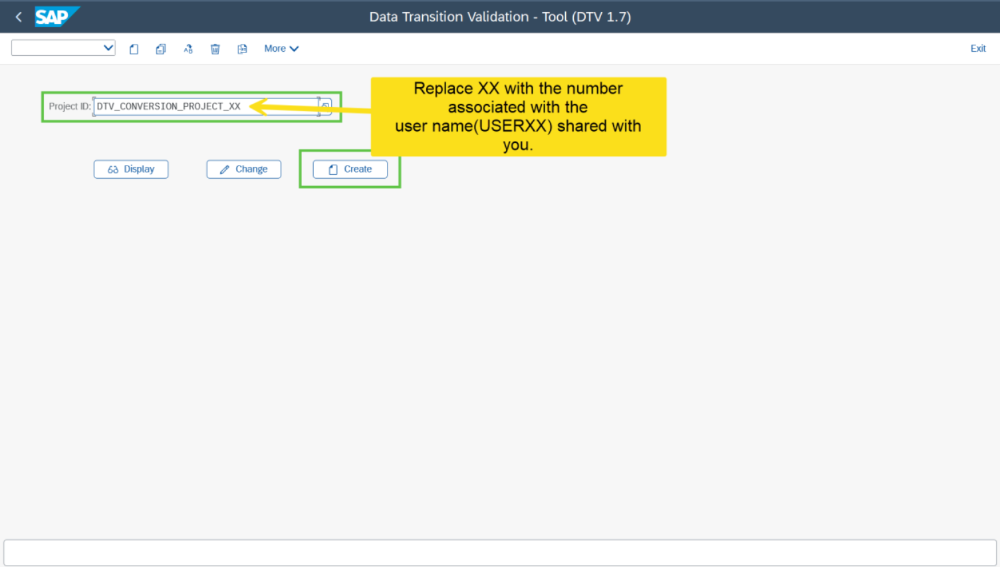
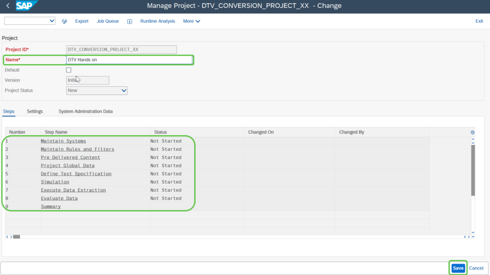

# Exercise 2: Create DTV Project

💡 At the end of this exercise, you will know how to create a DTV project and DTV steps available for the project.

## Step 1

To create a DTV project, provide a project ID and click on the **“Create”** button.

## Step 2

In the subsequent screen provide the **“Project Name”** and click on save.

> **Note:** In this screen you will see the 9 different steps of the DTV tool.

## Next Exercise

Continue to **[Exercise 3: Maintain System](../ex3/README.md)**.
