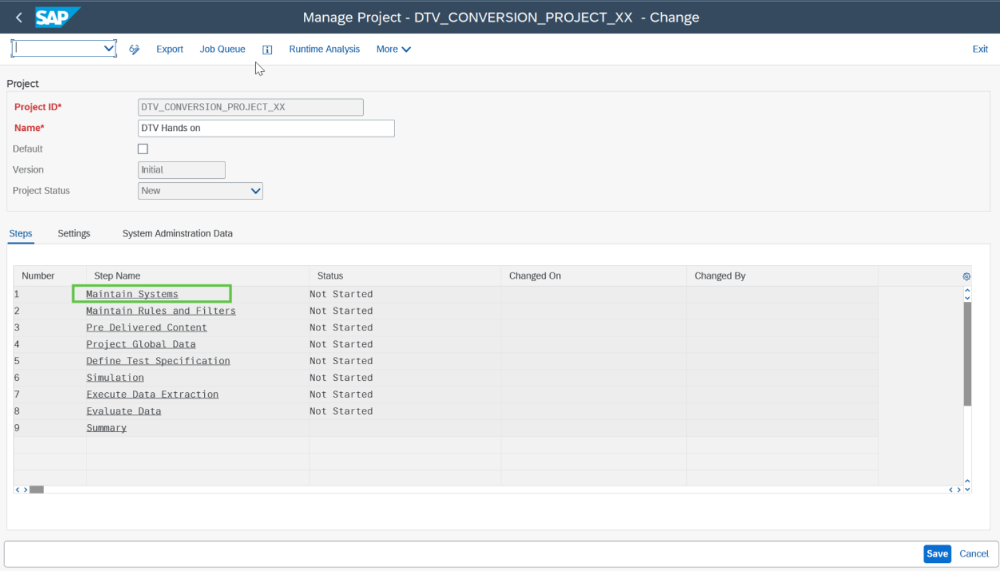
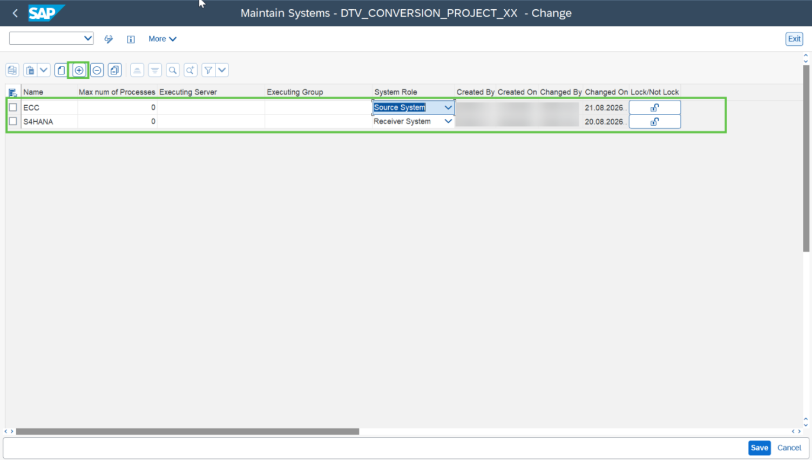

# Exercise 3: Maintain System

💡 At the end of this exercise, you should be able to maintain the source and target system details in the “Maintain Systems” step of your project.

## Step 1

To maintain the source and target system information, double click on the **“Maintain Systems”** step of the tool.

## Step 2

Click on the **Insert row** icon and provide the Source and Target system information one after other. Click on Save.

> **Note:** Select the system role for the source and target system as **“Source System”** and **“Receiver System”** respectively.

## Next Exercise

Continue to **[Exercise 4: Import the Pre-delivered Content and perform Import Specification](../ex4/README.md)**.
