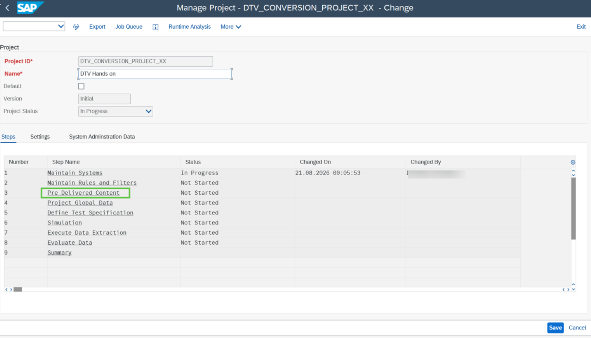
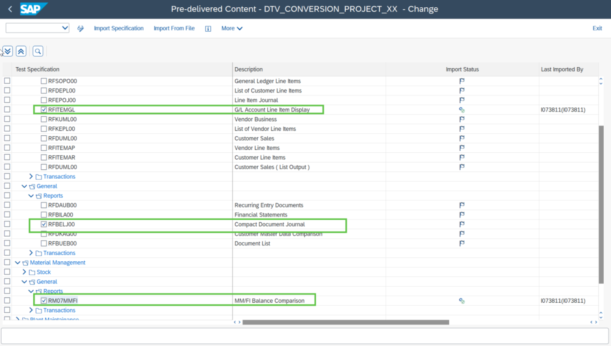
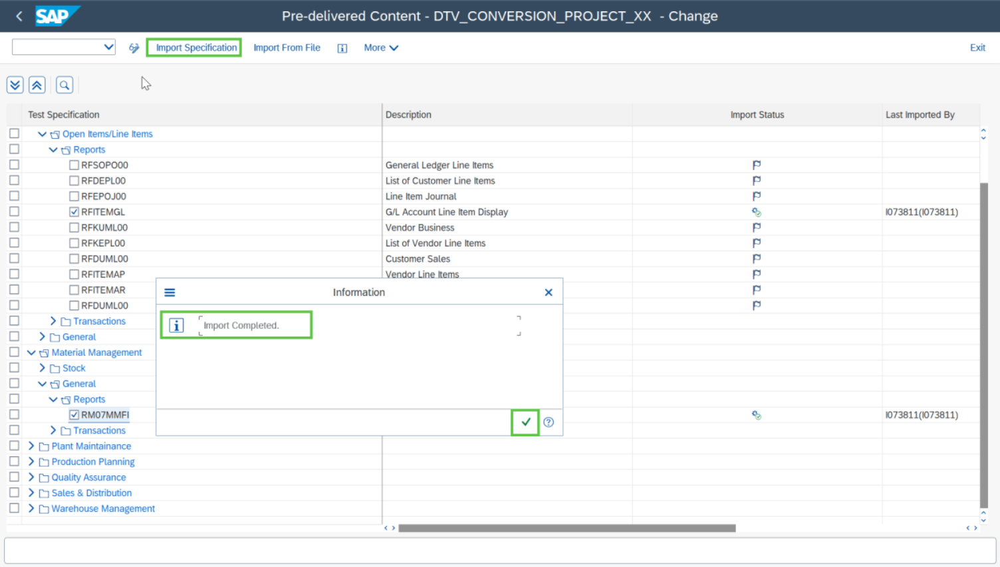

# Exercise 4: Import the Pre-delivered Content and perform Import Specification

💡 At the end of this exercise, you should be able to import the pre-delivered content and able to see the reports added to the Test specification

## Step 1

To import pre-delivered content, double click on the step **“Pre-Delivered Content”**.

## Step 2

Select the SAP reports (mentioned in the table below) from the pre-delivered content.

| Functional Area | Functional Area Specific | Report Name |
|---|---|---|
| Financial Accounting | Open Items/ Line Items | `RFITEMGL` |
| Financial Accounting | General | `RFBELJ00` |
| Material Management | General | `RM07MMFI` |

## Step 3

Click on **“Import Specification”** and click on the Ok button.

> **Note:** The imported pre-delivered content now will appear in the **“Test Specification”** step of the project. Go to the **“Test Specification”** step and check the imported reports.

> **Note:** To upload the latest version of the pre-delivered content you can use the **“Import From File”** button. The newly available reports are uploaded via xml file using SAP Note: **Pre- delivered Content**.

## Next Exercise

Continue to **[Exercise 5: Define Test specification for the selected Reports](../ex5/README.md)**.
