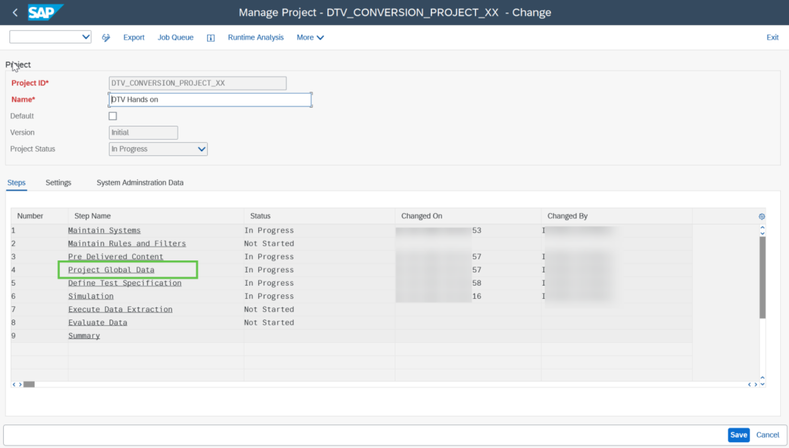
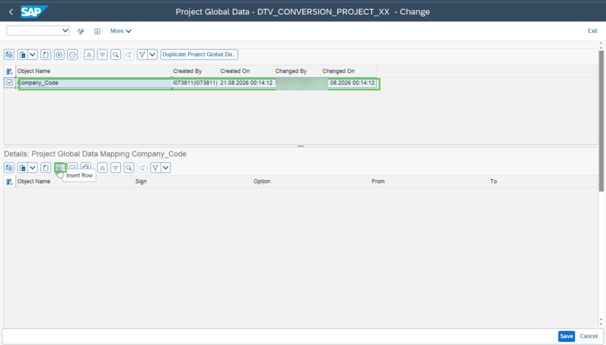
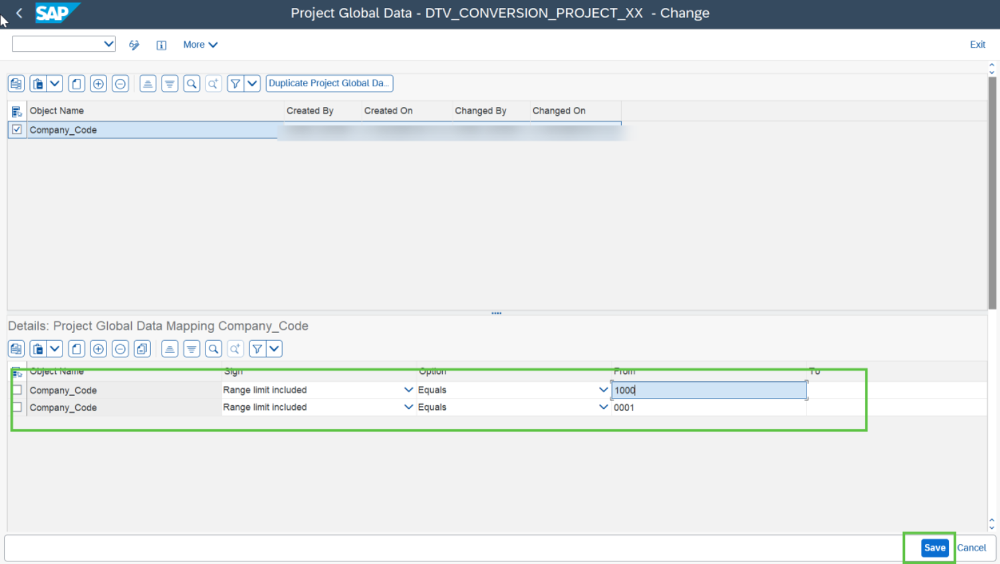

# Exercise 5.1: Maintain Project Global Data

## Step 1

To maintain the project global data, double click on **“Project Global Step”** of the DTV project.

## Step 2

In the project global data screen, start providing the details of the project global data such company code on the Insert Row button highlighted in the below screen shot.

For the Company Code, provide the details as highlighted in the screen shot below.

> **Note:** Once the project global data is created, this can be used in the **“Test Specification”** step as the Split parameter.

## Next Exercise

Continue to **[Exercise 5.2: Complete the test specification for RFITEMGL](../ex5-2/README.md)**.
