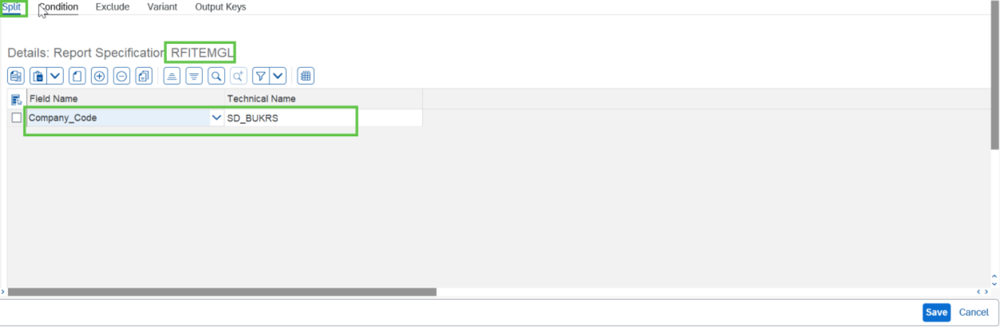
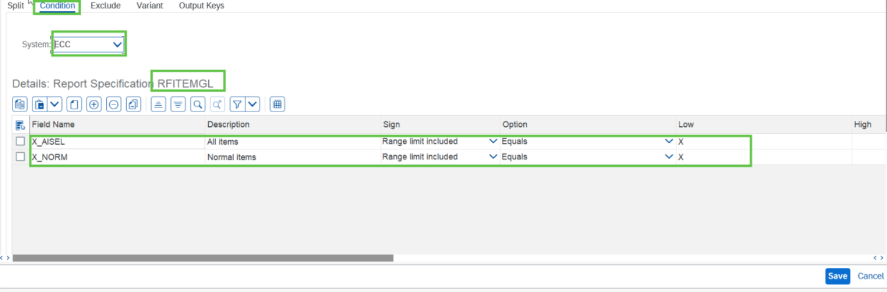
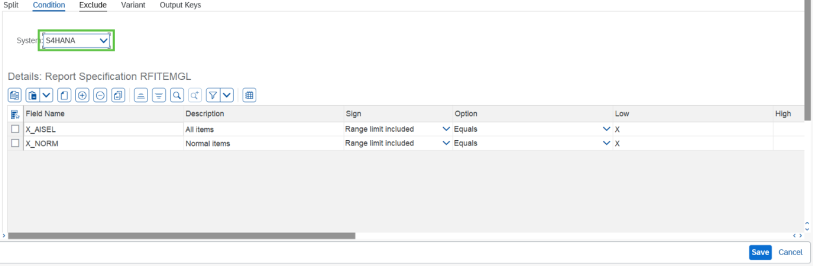

# Exercise 5.2: Complete the test specification for RFITEMGL

## Step 1

In the Test Specification screen double click on report **RFITEMGL** and provide/check the split parameter.

## Step 2

Similarly provide condition for **Source** and **Target** system in the condition tab.

## Next Exercise

Continue to **[Exercise 5.3: Complete the test specification for RM07MMFI](../ex5-3/README.md)**.
