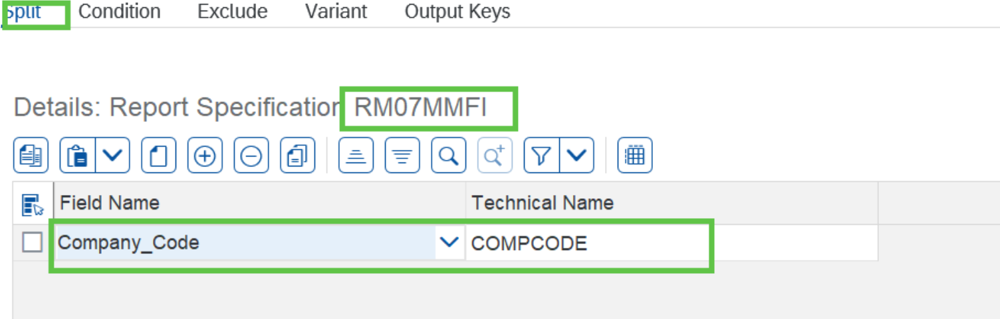

# Exercise 5.3: Complete the test specification for RM07MMFI

## Step 1

In the Test Specification screen double click on report **RM07MMFI** and provide/check the split parameter.

## Next Exercise

Continue to **[Exercise 5.4: Complete the test specification for RFBELJ00](../ex5-4/README.md)**.