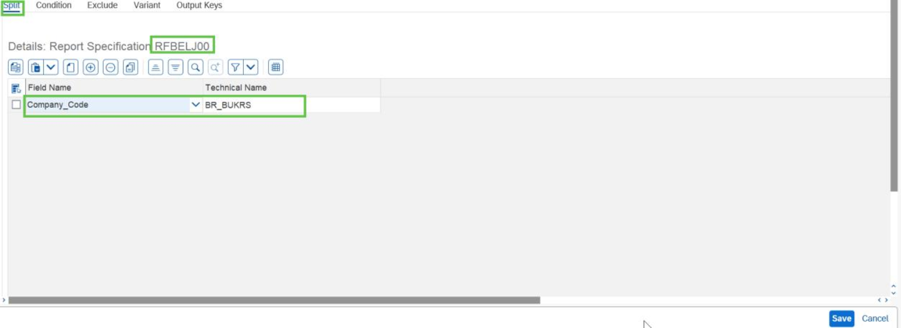
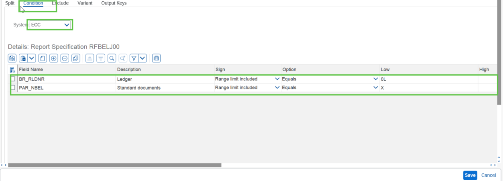
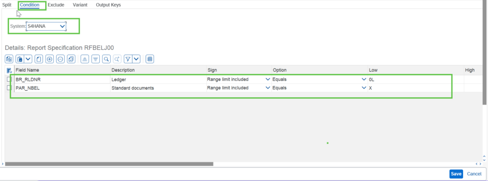

# Exercise 5.4: Complete the test specification for RFBELJ00

## Step 1

In the Test Specification screen double click on report **RFBELJ00** and provide/check the split parameter.

## Step 2

Similarly provide condition for **Source** and **Target** system in the condition tab.

## Next Exercise

Continue to **[Exercise 6: Run Simulation](../ex6/README.md)**.
