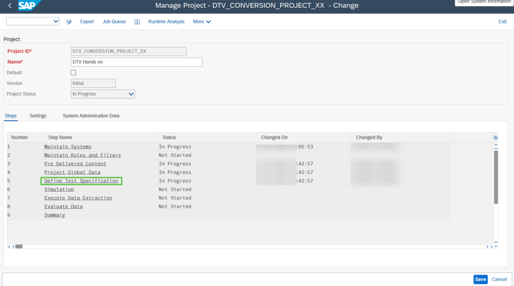
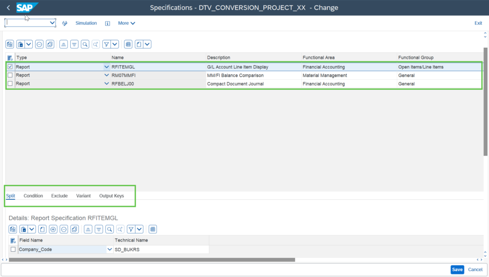

# Exercise 5: Define Test specification for the selected Reports

💡 At the end of this exercise, you should be able to Maintain the Project Global Data and configure test specifications for the selected reports
## Step 1

Double click on **Test Specification**.

## Step 2

You should be able to find the added pre-delivered content reports here and see the report definition area where you can define the **“Split”**, **“Condition”**, **“Variant”** etc.

## Step 3

DTV already provides Split parameter for the reports; however, the user needs to Maintain the Project Global data to use it as a split parameter.

## Next Exercise

Continue to **[Exercise 5.1: Maintain Project Global Data](../ex5-1/README.md)**.
