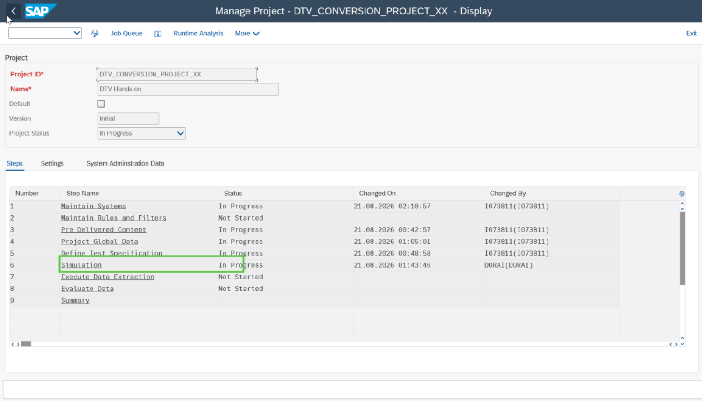
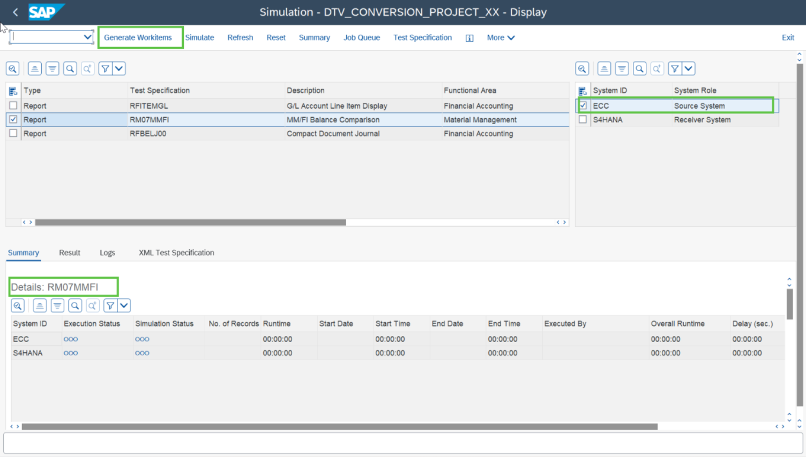
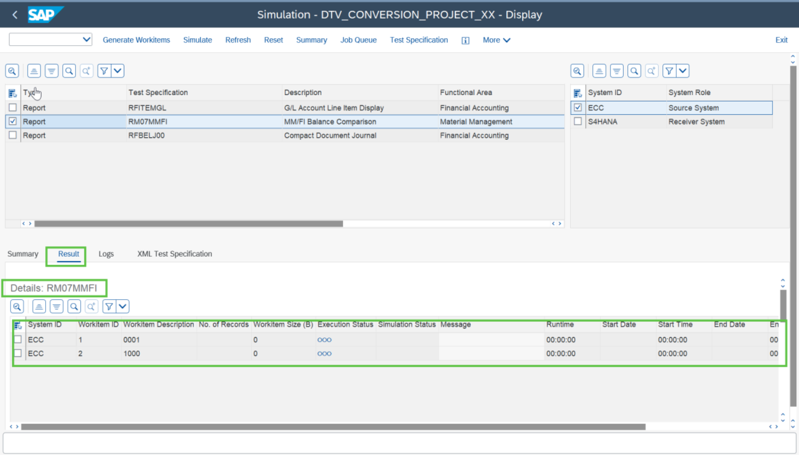
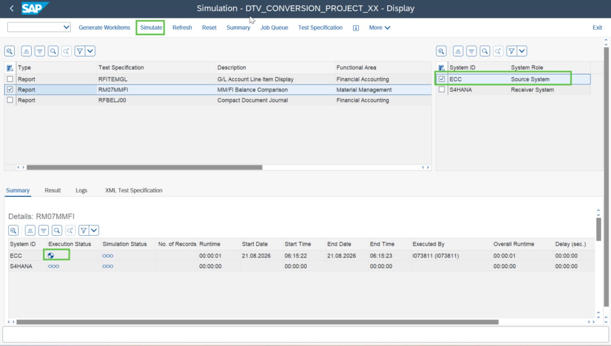
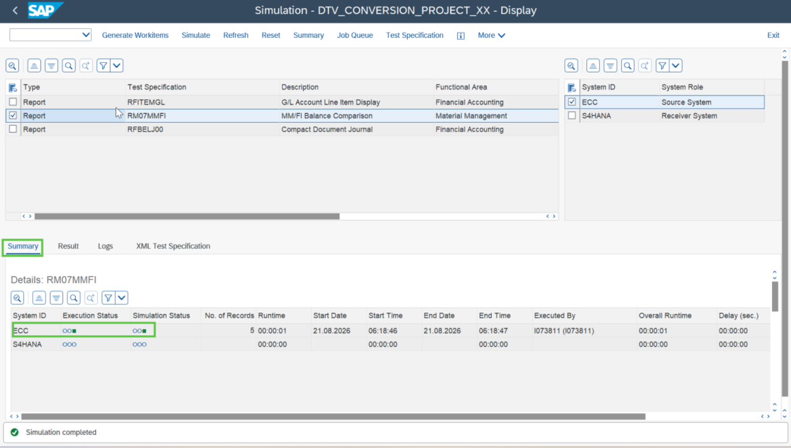

# Exercise 6: Run Simulation

💡 At the end of this exercise, you should be able to run Simulation for the reports.

## Step 1

Click on the **Simulation** as highlighted in the below screen shot and navigate to the Simulation screen.

## Step 2

Double click on a report, select Source system and click on **“Generate Workitems”**. Use **“Refresh”** button to check the status.

You can check the generated work items in the Result tab, highlighted in the below screenshot. Use **“Refresh”** button to check the status.

> **Note:** Workitems are generated as per the value given in the split parameter. It is worth noting that Split parameters are nothing but the project global data that you had defined in the project global data step earlier.

## Step 3

Once work items are generated, click on **“Simulate”** as highlighted in the below screen.

> **Note:** Generate work items and run simulation for rest of the reports e.g. RFITEMGL and RFBELJ00.

> **Note:** Simulation is a recommended but an optional step.

## Next Exercise

Continue to **[Exercise 7: Add Custom report and Configure Test Specification](../ex7/README.md)**.
