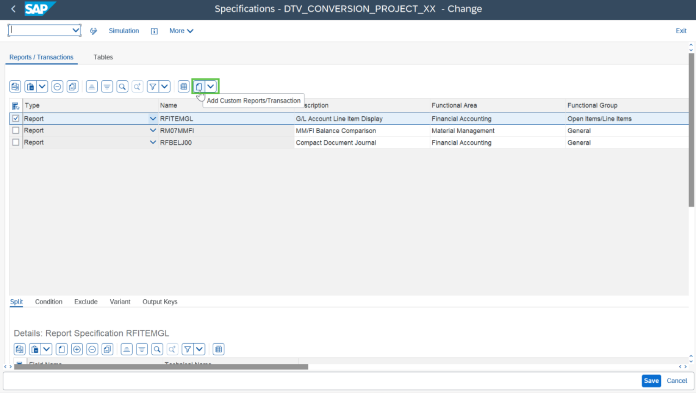
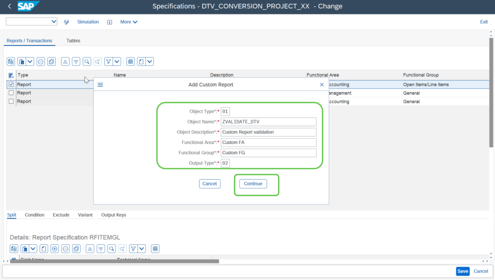
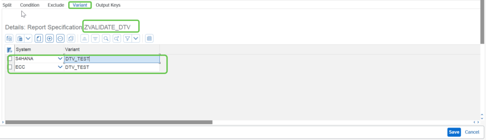

# Exercise 7: Add Custom report and Configure Test Specification

💡 At the end of this exercise, you should be able to add a custom report and add the variants for the source and target system.

## Step 1

To add a custom report, click on the icon **“Add Custom Reports/Transactions”** in the test specification screen as highlighted in the below screen shot.

## Step 2

Provide the custom report details as shown in the screenshot below. Click on Continue.

> **Note:** ZVALIDATE_DTV custom report and its variants have already been created in the system for this hands-on exercise.

## Step 3

Provide the variant as mentioned in the screen shot below. Click on **Save**.

## Next Exercise

Continue to **[Exercise 8: Execute Data Extraction for the source system](../ex8/README.md)**.
