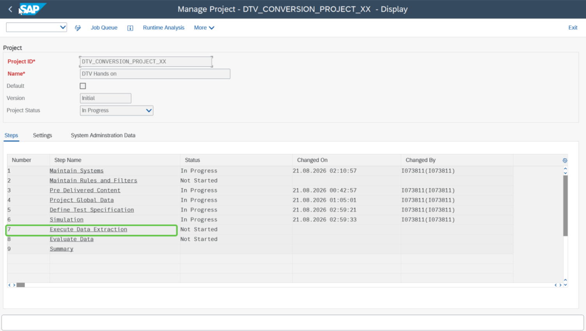
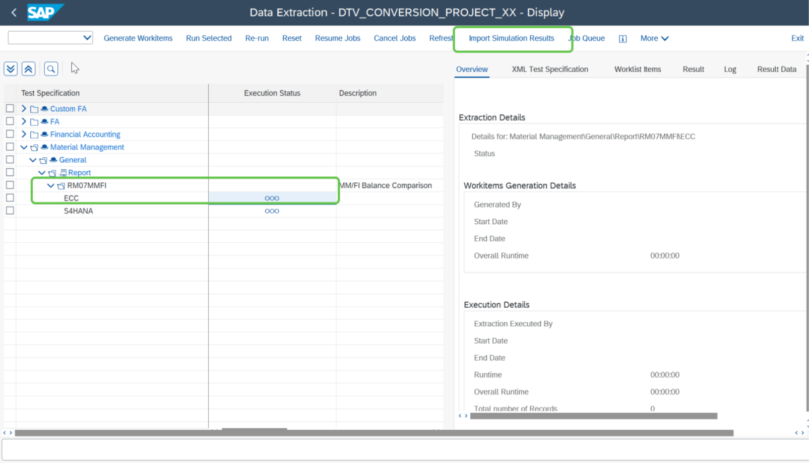
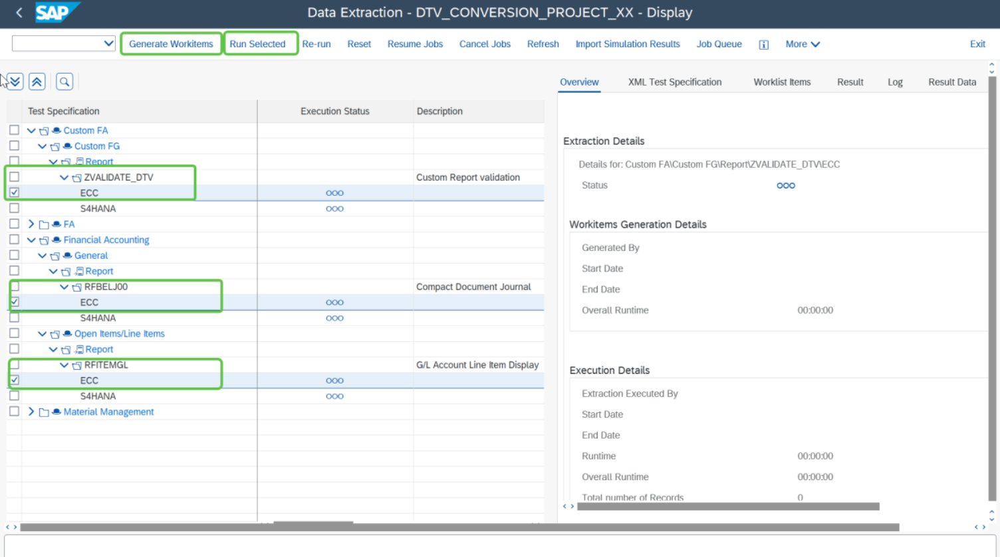

# Exercise 8: Execute Data Extraction for the source system

💡 At the end of this exercise, you should be able to add a custom report and add the variants for the source and target system.

## Step 1

Double click on DTV step **“Execute Data Extraction”**.

## Step 2

Select the report for which you already ran the Simulation and click on **“Import Simulation”** as highlighted in the below screen shot.

> **Note:** In this hands-on exercise, you ran simulation for report `/RM07MMFI` hence you can use **“Import Simulation Result”** for this scope item.

## Step 3

Extract Data for the custom report and remaining reports. Select the reports and click on **“Generate Workitems”**, followed by **“Run Selected”**.

> **Disclaimer!!**  
> After completion of the extraction in the source system, you will be logged into the target S/4HANA system where you will be able to find the project you created in the source system. Follow the instructions provided to login to the Target system.

## Next Exercise

Continue to **[Exercise 9: Login to the S/4HANA system and Execute Extraction](../ex9/README.md)**.
