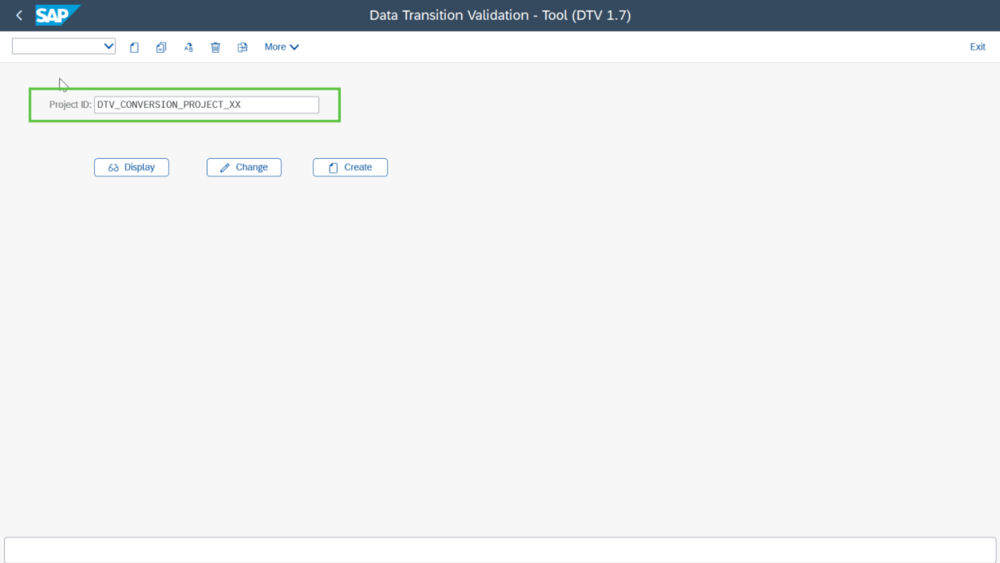
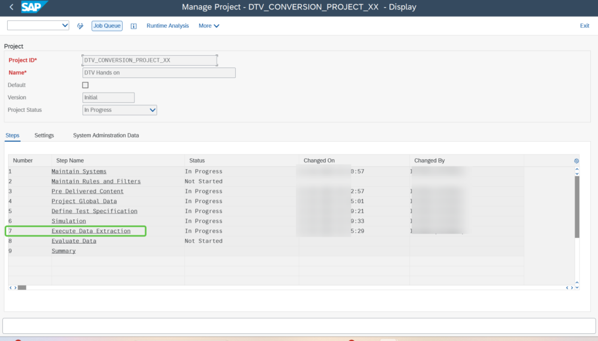
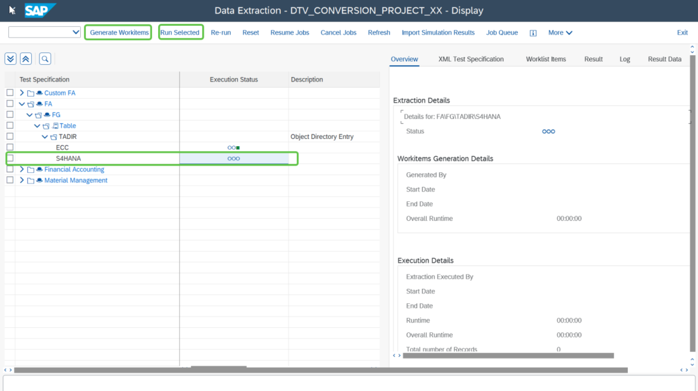
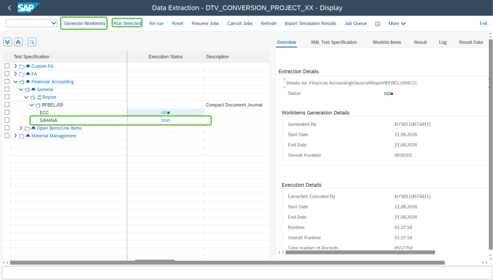

# Exercise 9: Login to the S/4HANA system and Execute Extraction

💡 At the end of this exercise, you should be able to run extraction for all the reports and tables in the target S/4HANA system

## Step 1

Login to the **SAP S/4HANA** target system by using the information shared with you.

**Username:** `USERXX`  
**Password:** `Welcome1`  
**Client:** `100`

## Step 2

Execute transaction code `DTV`. You will land on the DTV tool.

## Step 3

Search for the project that you created in the source system.

## Step 4

Double click on **Execute Data Extraction**.

## Step 5

Select the reports from the **Target S4HANA** node and start extracting the data first by clicking on **Generate Work Item** followed by **Run Selected**.

> **Note:** Make sure you run extraction for all the reports in the target node.

## Next Exercise

Continue to **[Exercise 10: Run Evaluation](../ex10/README.md)**.
